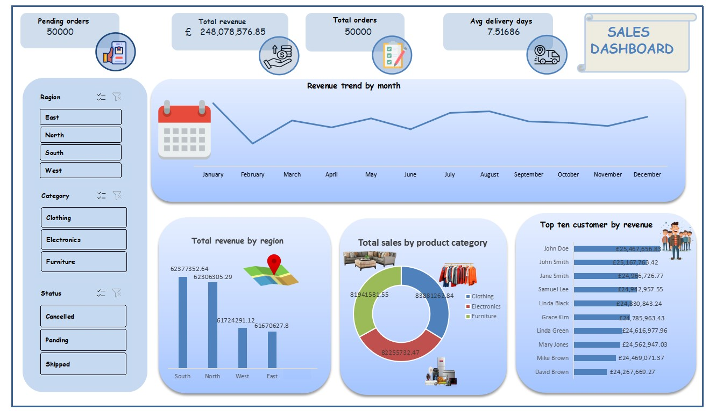
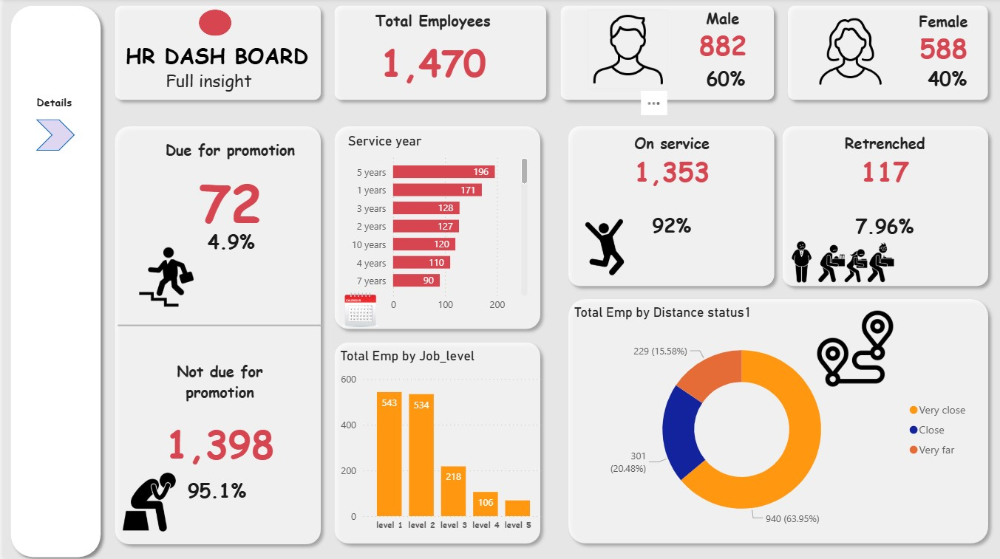

# Data Analytics Portfolio

## Project 1: [Sales Dashboard](https://github.com/Mr-vic34/Mr-vic34.Github.io/blob/main/My%20dashboard.xlsx)

### Tools Used:
- **Excel**  
  - Pivot Tables & Pivot Charts  
  - Conditional Formatting  
  - Data Validation (Dropdowns)  
  - Tables & Named Ranges  
  - Slicers & Timelines  
  - Formulas & Functions (SUMIFS, VLOOKUP, IF, AVERAGE, etc.)  
  - Charts: Line, Bar, Donut, Horizontal Bar  

---

### Project Description:
This project focuses on building a comprehensive **Sales Dashboard** in Excel to visualize and analyze the sales performance of a retail business. The dashboard provides an **interactive interface** to track revenue, orders, delivery times, and top-performing customers across regions, product categories, and customer segments. This enables decision-makers to **gain actionable insights quickly**.

---

### Key Findings:
- **Revenue Trends:** Monthly revenue shows fluctuations with peaks in mid-year, indicating **seasonal variations**.  
- **Regional Performance:** South and North regions generate the highest revenue; East and West contribute less.  
- **Product Insights:** Clothing and Electronics are the top-selling categories, followed by Furniture.  
- **Customer Impact:** Top 10 customers contribute significantly to total revenue, highlighting **key clients for targeted engagement**.  
- **Operational Insights:** Average delivery days are around **7.5**, providing insights into logistics efficiency.

---
###  Preview

---

### Dashboard Overview:
- **Top Metrics Displayed:** Pending orders, total revenue, total orders, and average delivery days.  
- **Interactive Filters:** Filter data by region, product category, and order status using slicers.  
- **Visualizations Included:**  
  - Line chart for revenue trends by month  
  - Bar chart for total revenue by region  
  - Donut chart for total sales by product category  
  - Horizontal bar chart for top 10 customers by revenue  
---
The dashboard uses a **clean, pastel color scheme** for clarity and readability, with **icons and images** to enhance comprehension of key insights.
---

### Repository Structure :
/Sales-Dashboard
│
├─ Sales_Data.xlsx # Raw sales dataset
├─ Sales_Dashboard.xlsx # Interactive Excel dashboard
├─ Dashboard_Screenshot.png # Screenshot of the dashboard
└─ README.md # Project description and details

# Data Analytics Portfolio

## Project 2: HR Dashboard

### Tools Used:
- **Power BI**  
  - Data Import & Transformation (Power Query)  
  - Measures & DAX Functions (SUM, COUNT, CALCULATE, FILTER, etc.)  
  - Visualizations: Card, Bar Chart, Column Chart, Donut Chart, Pie Chart, Table  
  - Slicers & Filters for interactive data exploration  
  - Conditional Formatting and KPI Indicators  
  - Custom Icons and Images for enhanced visual appeal  

---

### Project Description:
The **HR Dashboard** is a Power BI project designed to provide a **comprehensive overview of employee statistics and HR metrics** within an organization. The dashboard allows HR managers and decision-makers to **track workforce composition, promotion eligibility, service years, job levels, and employee distance status** at a glance. Interactive elements enable users to filter and analyze data dynamically, facilitating actionable insights for workforce planning and operational decisions.

---

### Key Findings:
- **Total Employees:** 1,470  
- **Gender Distribution:** 60% male (882), 40% female (588)  
- **Promotion Status:** 72 employees (4.9%) are due for promotion, while 1,398 (95.1%) are not  
- **Service Years:** Employees are distributed across multiple service years with the highest counts in 5 years (196), 1 year (171), and 3 years (128)  
- **Employment Status:** 1,353 employees (92%) are on service; 117 employees (7.96%) have been retrenched  
- **Job Levels:** Most employees are in level 1 (543) and level 2 (534), with fewer in higher levels  
- **Distance from Work:** Majority of employees (63.95%) live very close, 20.48% close, and 15.58% very far from the workplace  

---

### Dashboard Overview:
- **Top Metrics Displayed:** Total employees, gender distribution, employees on service, retrenched employees, and promotion eligibility  
- **Visualizations Included:**  
  - **Card visuals:** Key metrics like total employees, males, females, promotion due, on service, retrenched  
  - **Bar Chart:** Employees by service year and by job level  
  - **Donut Chart:** Employees by distance status  
- **Interactive Filters:** Slicers enable filtering by service year, job level, distance status, and other employee attributes  
- **Design:** Clean, professional layout using icons and contrasting colors for clarity and readability  

---

### preview:

# Data Analytics Portfolio

## Project 3: Sales Data Analysis Using Date Functions
---

## Project Overview
---
This project demonstrates the use of SQL Server date functions and aggregation techniques to analyze a Sales Dataset.
It focuses on retrieving, grouping, and summarizing sales data using different date-based SQL queries to generate valuable business insights such as revenue trends, top customers, delivery performance, and order patterns.

### Project Objectives

-Practice SQL date functions using T-SQL.

-Analyze sales performance by year, month, week, and day.

-Calculate delivery times and track shipping delays.

-Find top-performing products, customers, and regions.

-Showcase data analysis skills using SQL.

---
## Tools & Technologies
---
SQL Server – Query execution and data analysis

---

## Table Name: SalesData$
## Columns Used:

-OrderID – Unique order identifier

-Product – Name of the product

-Quantity – Quantity ordered

-UnitPrice – Price per unit

-OrderDate – Date of the order

-CustomerID – Unique customer identifier

-Region – Sales region

---
## Key SQL Queries & Insights
---

---------------------------------------------------------------
-- 1. Show all orders placed in 2024
---------------------------------------------------------------
- SELECT 
- [OrderID],
- [Product], 
- [Quantity],
- [OrderDate]
- FROM [dbo].[SalesData$]
- WHERE [OrderDate] BETWEEN '2024-01-01' AND '2024-12-31'
- ORDER BY [OrderDate] DESC;

---------------------------------------------------------------
-- 2. Get the total sales for each year
---------------------------------------------------------------
- SELECT 
-    FORMAT([OrderDate], 'yyyy') AS Year_,
 -   SUM([Quantity] * [UnitPrice]) AS Total_Sales
- FROM [dbo].[SalesData$]
- GROUP BY FORMAT([OrderDate], 'yyyy')
- ORDER BY Total_Sales DESC;

---------------------------------------------------------------
-- 3. Show total revenue grouped by month and year
---------------------------------------------------------------
- SELECT 
-    FORMAT([OrderDate], 'yyyy-MM') AS Year_Month,
-    SUM([Quantity] * [UnitPrice]) AS Total_Sales
- FROM [dbo].[SalesData$]
- GROUP BY FORMAT([OrderDate], 'yyyy-MM')
- ORDER BY Total_Sales DESC;

---------------------------------------------------------------
-- 4. List all distinct years in the OrderDate column
---------------------------------------------------------------
- SELECT DISTINCT FORMAT([OrderDate], 'yyyy') AS Year_
- FROM [dbo].[SalesData$];

---------------------------------------------------------------
-- 5. Show the top 5 months with the highest total sales
---------------------------------------------------------------
- SELECT TOP (5) 
-    FORMAT([OrderDate], 'MMMM') AS Month_,
-    SUM([Quantity] * [UnitPrice]) AS Total_Sales
- FROM [dbo].[SalesData$]
- GROUP BY FORMAT([OrderDate], 'MMMM')
- ORDER BY Total_Sales DESC;

---------------------------------------------------------------
-- 6. Show all orders placed in the last 90 days
---------------------------------------------------------------
- SELECT *
- FROM [dbo].[SalesData$]
- WHERE [OrderDate] >= DATEADD(DAY, -90, GETDATE())
- ORDER BY [OrderDate] DESC;

---------------------------------------------------------------
-- 7. Find the difference in days between OrderDate and ShippedDate
---------------------------------------------------------------
- SELECT 
-    [OrderID],
-    [OrderDate],
-    [ShippedDate],
-    DATEDIFF(DAY, [OrderDate], [ShippedDate]) AS Shipping_Period
- FROM [dbo].[SalesData$];

---------------------------------------------------------------
-- 8. Get all orders where the ShippedDate is more than 5 days late
---------------------------------------------------------------
- SELECT 
-    [OrderID],
-    [OrderDate],
-    [ShippedDate],
-    DATEDIFF(DAY, [OrderDate], [ShippedDate]) AS Shipping_Period
- FROM [dbo].[SalesData$]
- WHERE DATEDIFF(DAY, [OrderDate], [ShippedDate]) > 5;

---------------------------------------------------------------
-- 9. Show the number of orders per quarter
---------------------------------------------------------------
- SELECT 
- DATEPART(YEAR, [OrderDate]) AS OrderYear,
- DATEPART(QUARTER, [OrderDate]) AS OrderQuarter,
- COUNT(*) AS TotalOrders
- FROM [dbo].[SalesData$]
- GROUP BY DATEPART(YEAR, [OrderDate]), DATEPART(QUARTER, [OrderDate])
- ORDER BY OrderYear, OrderQuarter;

---------------------------------------------------------------
-- 10. Display all orders placed on a Monday
---------------------------------------------------------------
- SELECT 
-    [OrderID],
-    [Customer],
-   [Product],
-    [Quantity],
-    FORMAT([OrderDate], 'dddd') AS Order_Day
- FROM [dbo].[SalesData$]
- WHERE DATENAME(WEEKDAY, [OrderDate]) = 'Monday';

---------------------------------------------------------------
-- 11. Get the names of customers who placed orders in December 2023
---------------------------------------------------------------
- SELECT 
-  [Customer],
-    [OrderDate]
- FROM [dbo].[SalesData$]
- WHERE [OrderDate] BETWEEN '2023-12-01' AND '2023-12-31'
- ORDER BY [OrderDate] DESC;

---------------------------------------------------------------
-- 12. Find the earliest and latest OrderDate
---------------------------------------------------------------
- SELECT
-    MAX(FORMAT([OrderDate], 'yyyy-MM-dd')) AS Max_Date,
-    MIN(FORMAT([OrderDate], 'yyyy-MM-dd')) AS Min_Date
- FROM [dbo].[SalesData$];

---------------------------------------------------------------
-- 13. Get total quantity sold for each product in 2025 only
---------------------------------------------------------------
- SELECT 
-    YEAR([OrderDate]) AS Year_,
-    [Product],
-    SUM([Quantity]) AS Total_Qty
- FROM [dbo].[SalesData$]
- WHERE YEAR([OrderDate]) = 2025
- GROUP BY [Product], YEAR([OrderDate])
- ORDER BY Total_Qty DESC;

---------------------------------------------------------------
-- 14. Show total revenue grouped by week of the year
---------------------------------------------------------------
- SELECT 
-    DATEPART(YEAR, [OrderDate]) AS Year_,
-    DATEPART(WEEK, [OrderDate]) AS Week_,
-    SUM([Quantity] * [UnitPrice]) AS Total_Revenue
- FROM [dbo].[SalesData$]
- GROUP BY DATEPART(YEAR, [OrderDate]), DATEPART(WEEK, [OrderDate])
- ORDER BY Total_Revenue DESC;

---------------------------------------------------------------
-- 15. List all orders where OrderDate equals today's date
---------------------------------------------------------------
- SELECT *
- FROM [dbo].[SalesData$]
- WHERE CAST([OrderDate] AS DATE) = CAST(GETDATE() AS DATE);

---------------------------------------------------------------
-- 16. Display average delivery time (ShippedDate - OrderDate) per region
---------------------------------------------------------------
- SELECT 
-    [Region],
-    AVG(DATEDIFF(DAY, [OrderDate], [ShippedDate])) AS Avg_Delivery_Days
- FROM [dbo].[SalesData$]
- WHERE [ShippedDate] IS NOT NULL
- GROUP BY [Region]
- ORDER BY Avg_Delivery_Days ASC;

---------------------------------------------------------------
-- 17. Show the last 10 orders based on OrderDate
---------------------------------------------------------------
- SELECT TOP (10) *
- FROM [dbo].[SalesData$]
- ORDER BY [OrderDate] DESC;

---------------------------------------------------------------
-- 18. Get total sales for the current month only
---------------------------------------------------------------
- SELECT  
-    SUM([Quantity] * [UnitPrice]) AS Total_Sales,
-    DATEPART(MONTH, GETDATE()) AS Current_Month
- FROM [dbo].[SalesData$]
- WHERE DATEPART(MONTH, [OrderDate]) = DATEPART(MONTH, GETDATE())
-   AND DATEPART(YEAR, [OrderDate]) = DATEPART(YEAR, GETDATE());

---------------------------------------------------------------
-- 19. Count the number of weekend orders (Saturday & Sunday)
---------------------------------------------------------------
- SELECT 
-    COUNT(*) AS Weekend_Orders
- FROM [dbo].[SalesData$]
- WHERE DATENAME(WEEKDAY, [OrderDate]) IN ('Saturday', 'Sunday');

---------------------------------------------------------------
-- 20. Show the top 5 customers by total revenue in 2024
---------------------------------------------------------------
- SELECT TOP (5) 
-    [Customer],
-    SUM([Quantity] * [UnitPrice]) AS Total_Revenue
- FROM [dbo].[SalesData$]
- WHERE YEAR([OrderDate]) = 2024
- GROUP BY [Customer]
- ORDER BY Total_Revenue DESC;
